# Service Failure Recovery Plan:

## 1. Alert Notification:

Set up monitoring and alerting for critical services using tools like Amazon CloudWatch.
Receive alerts through various communication channels, such as email or messaging platforms.

## 2. Identify Failure:

Quickly identify the affected service and its impact on the system.

## 3. Isolate Affected Area:

Determine if the failure is isolated to a specific component or if it's affecting the entire system.
Isolate the affected area to prevent further impact on other components.

## 4. Escalate to On-Call Team:

Trigger an escalation process to involve the on-call support team.
Ensure that team members with the necessary expertise are alerted.

## 5. Analyze Root Cause:

Investigate the root cause of the failure.
Review logs, error messages, and metrics to understand the underlying issue.

## 6. Mitigation Actions:

Implement immediate actions to mitigate the impact:
If feasible, restore a backup of the affected service.
If it's a containerized service, restart the container or deploy a new instance.
If it's a database failure, failover to a standby instance if available.

## 7. Communicate with Stakeholders:

Keep stakeholders informed about the incident, its impact, and the actions being taken.

## 8. Resolution and Validation:

Monitor the service after mitigation to ensure that it's stable.
Perform thorough testing to confirm that the issue has been resolved.

## 9. Post-Incident Review:

Conduct a post-incident review to analyze the incident response process.
Identify areas for improvement and implement necessary changes.

