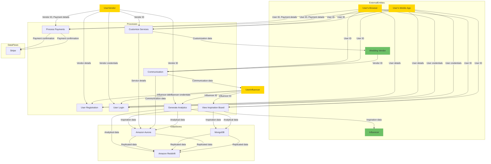

# data flow from one component to another

In this data flow diagram, the lines connecting components represent the flow of specific types of data. Here are the data definitions:

- User Registration: User details (user's information) flow from User's Browser and User's Mobile App to User Registration.
- User Login: User credentials (username and password) flow from User's Browser and User's Mobile App to User Login.
- View Inspiration Board: User ID (identification of the user) flows from User's Browser and User's Mobile App to View Inspiration Board. Inspiration data from Amazon Aurora and MongoDB flows to View Inspiration Board.
- Customize Services: User ID flows from User's Browser and User's Mobile App to Customize Services. Service details (details of services to be customized) flow from Customize Services to Amazon Aurora.
- Communicate: User ID flows from User's Browser and User's Mobile App to Communicate. Communication data (messages, chats, etc.) flow from Communicate to Amazon Aurora.
- Process Payments: User ID and Payment details (payment information) flow from User's Browser and User's Mobile App to Process Payments. Payment confirmation from Stripe flows to Process Payments.
- Generate Analytics: Analytical data (data for generating insights and trends) flows from Generate Analytics to Amazon Redshift, Amazon Aurora, and MongoDB.
- Amazon Aurora and MongoDB: Replicated data (data replicated between the databases) flows from Amazon Aurora and MongoDB to Amazon Redshift.

The color variations for the lines indicate the flow of data between different types of entities, processes, and data stores.