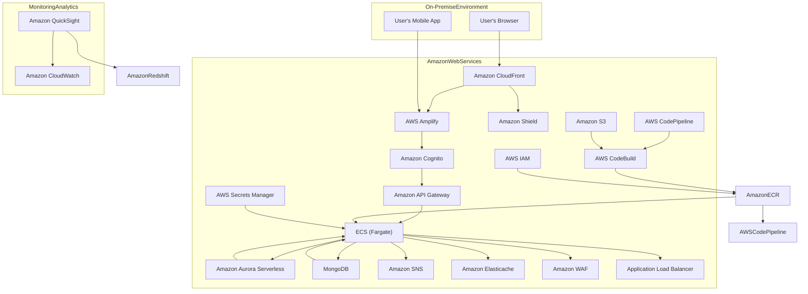

# Deployment Plan:

1. **Environment Setup:**
   - Prepare the necessary AWS resources, including VPC, subnets, security groups, and IAM roles.

2. **Containerization:**
   - Containerize backend microservices using Docker.
   - Create Docker images for each microservice.

3. **Container Registry:**
   - Set up an Amazon ECR repository to store Docker images.

4. **Continuous Integration:**
   - Use AWS CodePipeline to automate CI/CD pipelines.
   - Configure pipelines to trigger on code commits.

5. **Build and Test:**
   - Use AWS CodeBuild to build Docker images and run tests.
   - Ensure code quality and pass all tests.

6. **Artifact Storage:**
   - Store build artifacts and Docker images in Amazon S3.

7. **Continuous Deployment:**
   - Automate deployment using AWS CodePipeline.
   - Deploy Docker images to ECS Fargate.

8. **Database Deployment:**
   - Set up Amazon Aurora Serverless and MongoDB databases.

9. **Configuration Management:**
   - Use AWS Secrets Manager for managing database credentials.
   - Configure environment variables for microservices.

10. **Scaling and Monitoring:**
    - Configure ECS Fargate to scale based on CPU and memory usage.
    - Set up CloudWatch Alarms for monitoring resources.

11. **Load Balancing:**
    - Use Application Load Balancer to distribute traffic to ECS tasks.

## Deployment Diagram:

Similarly this can be extended for different environments